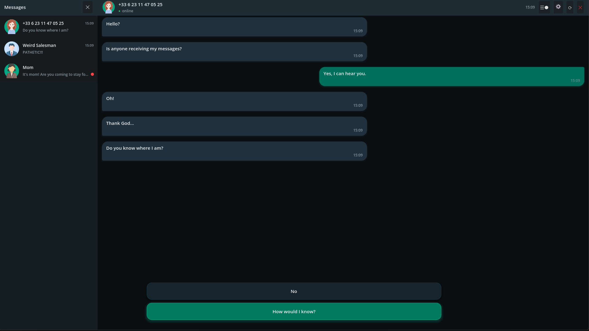
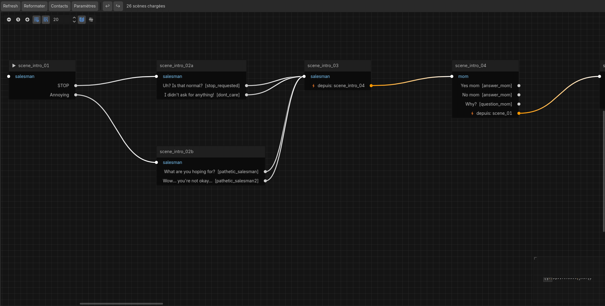
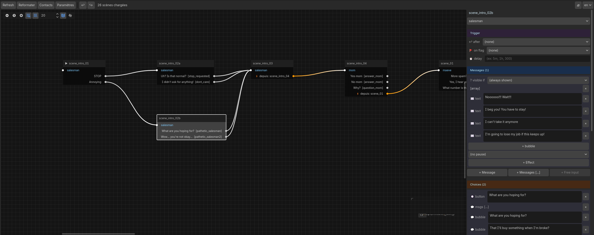

# Lost Signal — Getting Started

This guide takes you from opening the project to your first playable Lost Signal story. It doesn't replace the [Authoring Guide](authoring_en.md) or the [Story Editor](story_editor_en.md) docs — it shows you the steps in order.

---

## How a Lost Signal story is organised

```
Your story
 └── Dialogue files    (.json files in the dialogues/ folder)
      └── Scenes       (= nodes in the Story Editor)
           └── Messages, choices, conditions, effects
```

A scene in the JSON file = a node in the graph. Both terms are used interchangeably throughout this guide.

---

## Requirements

- **Godot 4.6** or higher ([godotengine.org](https://godotengine.org))
- No GDScript knowledge needed — your story is built from the Story Editor and stored in JSON files

---

## Step 1 — Open the project

1. Launch Godot
2. In the project manager, click **Import** and select the project folder
3. Click **Edit** to open it in the editor

---

## Step 2 — Run the demo

Press **F5** (or the ▶ button at the top right).

The *Maeve* demo opens: go through a few exchanges to see what the engine can do — animated bubbles, multiple choices, secondary contact, image in a bubble.



---

## Step 3 — Enable the Story Editor

1. **Project → Project Settings → Plugins**
2. Enable **Story Editor**
3. A **Story Editor** tab appears at the bottom of the editor (next to the Output console)

Click it. You'll see the graph of all scenes loaded by the project (including the demo scenes). Click a node to see its content in the right panel.

> Take a few minutes to explore `acte1.json` from the graph — it's your reference model.



---

## Step 4 — Create your contact

In the Story Editor, click **Contacts** (top bar).

The Contacts panel lets you configure `story.json` without opening the file:

1. If you want a clean start, delete the demo contacts. If you want to keep the demo as a reference, click **+ Contact** to add yours without touching the existing ones.
2. Set an **ID** (e.g. `emma`), a **display name**, a **status** (`online`, `away`, `offline`, `network_issue`)
3. Check **is_main** — this marks the character the player talks to from the start; checking it unchecks all others automatically

All changes are saved immediately — there is no Save button.

---

## Step 5 — Prepare your first story

1. On your computer, open the project folder and go into `dialogues/`.
2. Duplicate `acte1.json` and rename the copy (e.g. `my_story.json`).
3. Open `my_story.json` with any text editor (Notepad on Windows, TextEdit on Mac) and replace the entire content with — for this first setup, we're simply preparing an empty file; all the content will be created from the Story Editor:

```json
{ "scenes": [] }
```

4. Save the file, then click **Refresh** in the Story Editor toolbar.
5. **Right-click on the graph background** → fill in the ID (`intro`), select your contact, select `my_story.json` as the target file. A node appears in the graph.
6. Click the node and write your first message and choice in the detail panel on the right.

> The graph also shows the demo scenes from `acte1.json` — this is normal. Use the contact filter dropdown in the toolbar to show only your contact's scenes.

---

## Step 6 — Set the starting scene and contact

In the **Settings** panel (the **Settings** button in the Story Editor toolbar):

- Select `intro` from the **Start scene** dropdown
- Select your contact (e.g. `emma`) from the **Start contact** dropdown

Both are required — without them, pressing F5 will launch the Maeve demo instead of your story.

---

## Step 7 — Test

Press **F5**.

If `story.json` or your JSON file has an error, a validation window appears with details. Fix and relaunch.

If everything is correct, your first dialogue appears. Congratulations — you've just created your first Lost Signal scene.

> **Played the game before?** A previous save may be hiding your new content. From the main menu, click **New Game** to start fresh.

---

## Step 8 — Build your story

Once the project runs, work primarily from the Story Editor:

- **Right-click on the graph background** → create a new scene
- **Drag an output port to an input port** → connect two scenes (`next`)
- **Click a node** → edit text, pauses, choices, effects in the right panel
- **F9 in-game** → debug tool: jump to any scene instantly without replaying from the start



---

## Going further

- **[Authoring Guide](authoring_en.md)** — all JSON fields, conditions, effects, variables, triggers, timed messages
- **[Story Editor](story_editor_en.md)** — full plugin reference
- **`acte1.json`** — the demo is your best reference: nearly all engine features are illustrated there
