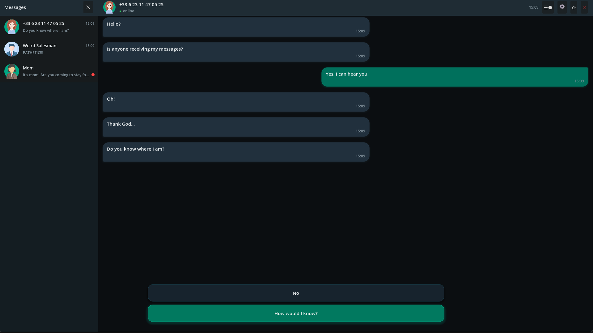
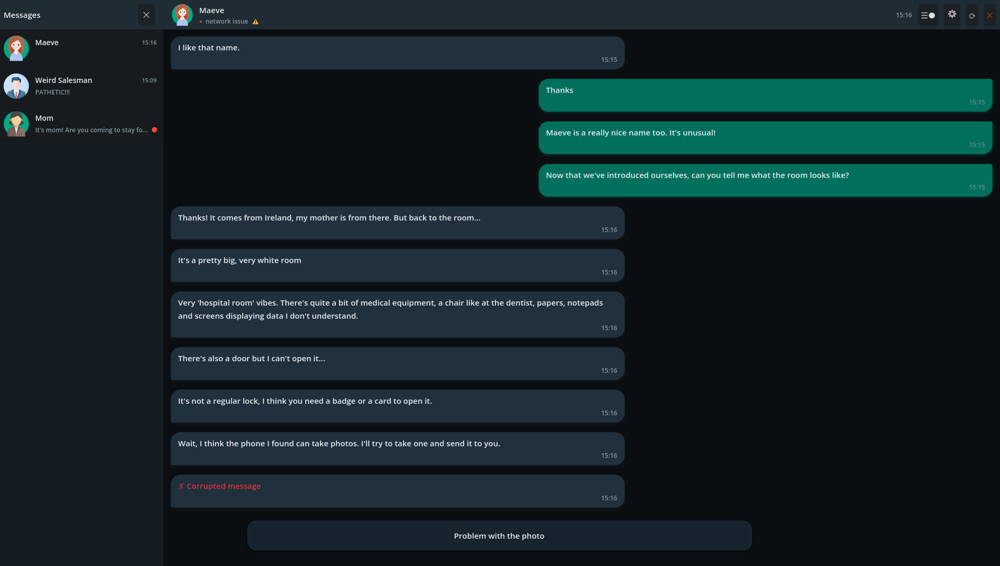
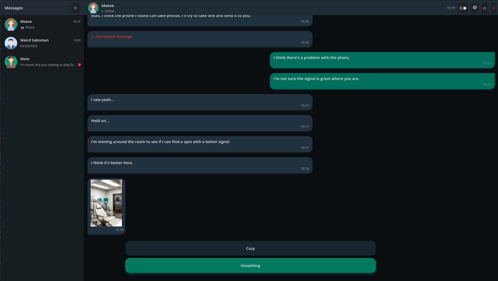
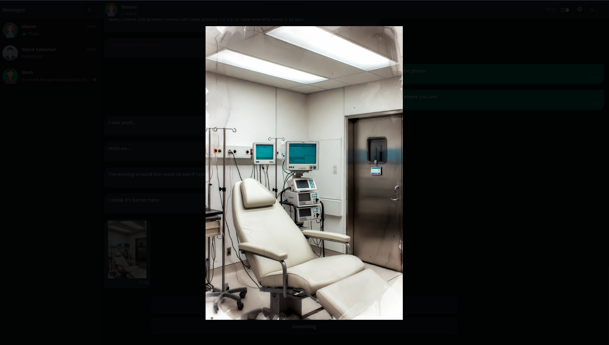

# Lost Signal — Narrative Messaging Engine for Godot 4

**Build messaging games. No code required.**

Lost Signal is a complete Godot 4 framework for stories that unfold through messages — the kind your players already know how to read. Multiple simultaneous contacts, branching dialogue, real-time delays, background events. Write everything from a visual editor. Press F5.



---

## What you can build

Anything that lives in a chat window:

- **Relationship stories** — friendships, breakups, slow-burn emotional drama
- **Thrillers and mysteries** — investigations spread across parallel conversations, conflicting accounts, hidden information
- **Horror** — corrupted messages, contacts that disappear, degraded signal, unreliable narrators
- **Sci-fi and survival** — remote messaging under pressure, *Lifeline*-style real-time delays
- **Psychological fiction** — shifting perspectives, fragmented communication, messages that contradict themselves

---

## Write visually, play immediately

The Story Editor renders your entire story as an interactive graph inside Godot. Click a node to edit its messages and choices. Drag ports to connect scenes. Right-click to create or delete.


No JSON required for the common cases. Advanced features (structured conditions, images, music) use the file directly — the built-in validator catches mistakes at launch, in the game window.

---

## Key features

**Real-time delays** — a character can say *"I'll message you in an hour"* and actually mean it. One field. Survives game restarts.

```json
{ "resume_after_delay": "1h" }
```

**Parallel conversations** — characters message the player in the background while they're reading something else. Notification badge appears. Player switches when they choose. Full branching conversation, not just a popup.

**Pre-existing histories** — contacts arrive with past conversations already visible and unanswered questions waiting. The player has a life before the story begins. Fully configurable from the Contacts panel, no file editing needed.

**Live message editing** — characters correct their own typos with a delay, delete messages, send corrupted transmissions. Hesitation, regret, second thoughts, signal failure — all built in.

**Contact status as narrative** — online, away, offline, network issue. A contact whose connection keeps dropping tells a story before a single message is sent.



**Media messages** — images sent as chat bubbles, tappable to view fullscreen. Audio messages with a dedicated playback bar.





**Full narrative logic** — flags, numeric variables, conditions (`and` / `or` / `not`), effects, free-text input, variable templates. No scripting.

**Automatic save** — after every player choice and every received message. Human-readable JSON save file. Main menu with New Game / Continue included.

---

## The authoring loop

```
1. Define contacts     →  name, avatar, status. Thirty seconds each.
2. Create scenes       →  right-click the graph background, type an ID.
3. Write content       →  click a node, type in the detail panel.
4. Connect scenes      →  drag an output port to another node's input.
5. Add logic           →  flags, conditions, effects — all via dropdowns.
6. Test                →  F5 to run. F9 to jump to any scene instantly.
```

No scripting at any point.

---

## Example scene

```json
{
  "id": "intro",
  "messages_in": [
    { "text": "Are you there?", "pause": "short" },
    { "text": "We need to talk." }
  ],
  "choices": [
    {
      "text": "Who is this?",
      "message": "Who are you?",
      "next": "scene_reveal",
      "flag": "asked_identity"
    },
    {
      "text": "Wrong number.",
      "message": "I think you have the wrong number.",
      "next": "scene_denial"
    }
  ]
}
```

Two messages arrive. Player picks a response. A flag is set. Story continues. No code written.

---

## What's included

- Full Godot 4.6+ project — open and run immediately
- Complete messaging UI: animated typing indicator, image and audio bubbles, avatars, contact statuses, multi-contact panel with unread badges
- Visual Story Editor: interactive scene graph, detail panel editing, Contacts panel, undo/redo on every action
- Debug overlay (F9) — jump to any scene, set flags, inject variables. No replay needed.
- Built-in story validator — errors appear in the game window at launch
- Playable demo scenario — every engine feature illustrated
- Bilingual authoring guide (EN + FR) with full syntax reference

---

## Before you start

Linear stories with branching choices are easy to build. Multi-contact parallel narratives — where characters message you independently — require thinking through the structure before you write.

Advanced features (structured `and`/`or` conditions, images in bubbles, scene music) need direct JSON editing. Basic JSON familiarity is enough; the validator catches most mistakes.

**→ [Getting Started](getting_started_en.md)** — from opening the project to your first dialogue, in 8 steps.

---

**Requirements:** Godot 4.6 or higher · Free · [godotengine.org](https://godotengine.org) · No external dependencies
