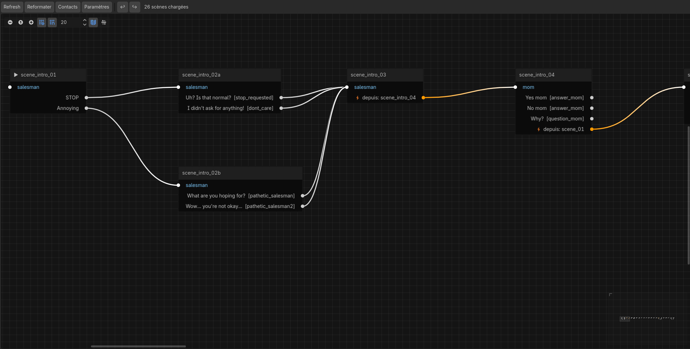
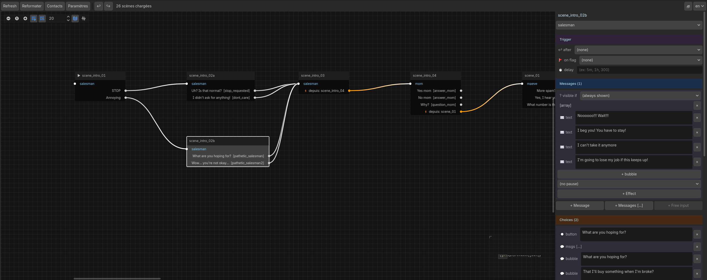

# Story Editor — User Guide

The Story Editor is a Godot plugin built into the project. It displays a **visual graph** of all narrative scenes defined in the JSON files, directly inside the Godot editor — without modifying the game outside of explicit editing actions.

---

## Activation

1. In Godot, open **Project → Project Settings → Plugins**
2. Enable **Story Editor**
3. A **Story Editor** tab appears at the bottom of the editor (bottom panel, next to the Output console)

---

## Interface

```
+------------------------------------------------------------------------------+
| [Refresh]  [Reformat]  [Contacts]  [Settings]  |  [↩]  [↪]   11 scenes      |
+------------------------------------------+-----------------------------------+
|                                          |  scene_04                         |
|  [> ch1_intro] --> [scene_01] --------> |  Contact  [Maeve         v]        |
|                         |               |                                    |
|  [! orphan]      [X scene_02]           |  Messages -------------------      |
|                                          |                                   |
|  [~ scene_03] - - - trigger - - - ->    |   Hello!                  [x]      |
|                                          |   +---------------------------+   |
|                                          |   | I'm writing from the     |    |
|                                          |   | train.                   |    |
|                                          |   +---------------------------+   |
|                                          |   pause    [medium  v]            |
|                                          |   requires [--      v]            |
|                                          |                                   |
|                                          |  Choices  ----------------        |
|                                          |   That's spam    -> [-- v] [x]    |
|                                          |   Yes, I hear you-> [-- v] [x]    |
|                                          |   [+ choice]                      |
+------------------------------------------+-----------------------------------+
```

Legend: `[> id]` = start scene · `[! id]` = orphan · `[X id]` = dead end · `[~ id]` = free input · `- - ->` = trigger connection



- **Refresh button**: re-reads the JSON files and rebuilds the graph. Use it after editing any dialogue file manually. Edits made from the graph trigger an automatic refresh.
- **Reformat button**: rewrites all JSON files with the canonical semantic key order, without changing any content. Useful for cleaning up a manually edited file or migrating an existing file to the standard format.
- **Contacts button**: opens the [Contacts panel](#contacts-panel) — a floating window for managing the character list.
- **Settings button**: opens the [Settings panel](#settings-panel) — a floating window for global settings, languages, and the end screen.
- **↩ / ↪ buttons**: undo / redo the last action (same as Ctrl+Z / Ctrl+Y).
- **Graph** (main area): nodes are draggable, zoomable with the mouse wheel, and navigable by holding middle-click or Space + drag.
- **Detail panel** (right): clicking a node displays its full content. Message and choice text fields are directly editable.

---

## Graph Nodes

Each JSON scene maps to one node. The title of the node is the scene's `id`.

### Visual Indicators

| Indicator | Meaning |
|---|---|
| **▶** before the ID | Starting scene (`start_scene` in `story.json`) |
| **✎** after the ID | Scene with `free_input` (player types a free-text response) |
| **⛔ Dead end** (red) | The scene has no outgoing connections — likely an authoring oversight |
| **⚠ Isolated** (yellow) | No other scene points to this one — it can never be reached |

### Connection Types

Arrows between nodes are color-coded by their nature:

| Color | Type | Description |
|---|---|---|
| Light gray | `next` or `choice` | Normal continuation or player choice |
| Orange | `trigger` | Automatic trigger via `trigger_after_scene` |
| Purple | `resume` | Conditional resume via `resume_after_flag` |

### Ports

Each node has:
- **One input port** (left) — receives connections from preceding scenes
- **One output port per connection** (right) — one per `next`, one per choice (`choices[]`)

If a scene has choices without a destination (`next` absent), **each choice gets its own output port** — visible without a wire, ready to be connected. Dragging from that port to another node writes `next` into the correct choice.

If a scene has neither choices nor `next`, a **→ ?** port is shown: dragging from it to another node will add a scene-level `next` field.

---

## Detail Panel



> **The editor is a practical aid for writing scenes without touching JSON.** It covers the vast majority of common use cases. Some advanced features (structured `and`/`or` conditions, media, deferred corrections, music) are only accessible via direct JSON editing — see [What JSON Allows Beyond the Editor](#what-json-allows-beyond-the-editor) at the end of this document.

Clicking a node opens the detail panel on the right. All fields are **directly editable** and saved **as soon as the field loses focus** (click elsewhere or Tab).

### Scene level

| Field | Interface |
|---|---|
| Contact | Dropdown — all contacts in the project |
| `trigger_after_scene` | Scene dropdown — triggers when the selected scene has just played |
| `resume_after_flag` | Flag dropdown — waits in the background until this flag is set |
| `resume_after_delay` | Free text — accepts `300` (seconds), `"5m"`, `"1h"` |
| `free_input` (var) | **+ Free input** button → text field for the variable name |
| `free_input_placeholder` | Text field — hint text shown in the player's input field |

### Per message

| Field | Interface |
|---|---|
| Simple text | Multi-line text area + × to delete |
| Array text (bubbles) | Each bubble editable separately + **+ bubble** to add one |
| `requires_flag` | Flag dropdown — hides the message if the flag is not set |
| `pause` | Dropdown — `(none)`, `short`, `medium`, `long` |
| `effects` | One row per effect: op dropdown + target dropdown + value field + ×; **+ Effect** to add |

### Per choice

| Field | Interface |
|---|---|
| Button text | Multi-line text area + × to delete |
| `message` (player bubble) | **Absent**: **+ msg** button (single bubble) and **+ msgs [...]** button (multiple consecutive bubbles) · **String**: editable text field + × to remove · **Array**: each bubble editable separately + **+ bubble** to add one + × to remove the entire array |
| `flag` | Text field — flag set when this choice is selected |
| `requires_flag` | Flag dropdown — hides this choice if the flag is not set |
| `next` | Scene dropdown — scene played after this choice |
| `effects` | Same interface as message effects |

### Effects (`effects`)

Each effect has three fields:

| Op | Target | Value |
|---|---|---|
| `set` | Variable dropdown | Value to assign |
| `add` | Variable dropdown | Value to add |
| `sub` | Variable dropdown | Value to subtract |
| `rename` | Contact dropdown | Inline name editor: a `—` row for an invariant name (same in all languages), or one row per language code. Click **+ Language** to add localized entries — the invariant entry is automatically converted to the first language entry. A language code is highlighted orange if no matching `*.{code}.json` file exists in `dialogues/`. |
| `set_status` | Contact dropdown | `online` / `away` / `offline` / `network_issue` |

### Free input vs Choices

`free_input` and `choices` are **mutually exclusive**: the engine ignores choices if free input is defined. The editor reflects this: **+ Free input** is greyed out if choices exist, and **+ Choice** is greyed out if free input is active.

---

## Editing from the Graph

All edits are **written immediately to the corresponding JSON file**, then the graph is rebuilt automatically. No confirmation is required except for deletion.

### Create a Scene

**Right-click on the graph background** (not on a node) → creation dialog:

- **ID**: unique scene identifier (e.g. `scene_10`). If the ID already exists, creation is rejected.
- **Contact**: dropdown listing all contacts defined in `story.json`.
- **File**: if multiple JSON files exist in `dialogues/`, an extra dropdown lets you choose which file to write the scene into.

The scene is appended to the file with an empty message `{ "text": "" }`. It appears in the graph with the **⚠ Isolated** indicator until an incoming connection is created.

### Connect Two Scenes

**Drag from an output port** (right circle of a node) **to the input port** (left circle) of another node.

- If the output port corresponds to a **choice**, that choice's `next` field is written to the JSON.
- If the output port corresponds to the **scene-level `next`** (or the **→ ?** port), the scene's `next` field is written.
- If the port already had a destination, it is **replaced** by the new one.

> `trigger` and `resume` connections are read-only — they reflect JSON fields but cannot be modified from the graph.

### Disconnect or Remove a Connection

**Right-click on the source node** → the context menu lists all active outgoing connections:

```
Delete this scene
─────────────────────
Disconnect: That's spam → scene_02
Disconnect: Yes, I hear you → scene_02
```

Clicking a "Disconnect" entry removes the corresponding `next` from the JSON (the choice or scene `next` remains but without a destination).

### Delete a Scene

**Right-click on the node** → **Delete this scene** → confirmation dialog.

On confirmation:
- The scene is removed from its JSON file.
- All `next` and `choices[].next` fields pointing to this scene are removed across **all JSON files** in the project.
- The graph is rebuilt.

> Deletion can be undone with **Ctrl+Z**.

### Undo / Redo

All editing actions from the graph and the detail panel support Godot's native undo and redo.

| Shortcut | Action |
|---|---|
| **Ctrl+Z** | Undo the last change |
| **Ctrl+Y** | Redo the last undone change |

Covered actions: connecting / disconnecting scenes, creating / deleting scenes, editing any field in the detail panel, **Reformat**, contact rename, all edits in the Contacts panel.

**Exception**: adding and removing languages (Languages section of the Contacts panel) are not undoable — those operations modify `ui.csv` and trigger a Godot reimport.

> The undo history is scoped to the current editor session.

---

## Settings Panel

Click the **Settings** button in the toolbar to open a floating window for global project settings in `story.json`. Everything writes immediately on change, with no Save button required.

### Global fields

| Field | Interface |
|---|---|
| `title` | Text field — displayed in menus and the window title bar |
| `start_scene` | Scene dropdown — first scene played on a new game |
| `start_contact` | Contact dropdown — contact whose conversation is shown on screen at launch; if empty, the main contact is used |

### Languages

The **Languages** section lists the project's active languages (detected from the `.translation` files generated by Godot in `translations/`) and lets you add new ones.

| Element | Role |
|---|---|
| Chip per language + **×** | Each active language is displayed as a chip with a **×** button. Clicking it removes that column from `ui.csv` (irreversible — all translations for that language are lost). The **×** is disabled when only one language remains. |
| Field + **+ Add** | Type an ISO 639-1 code (e.g. `de`) and click to add an empty column to `ui.csv`. Godot automatically regenerates the matching `.translation` file. |

> Adding or removing a language here only affects `ui.csv` (interface strings). For a new language, you also need to create the localised dialogue file (e.g. `acte1.de.json`) and fill in the `history` text fields for each contact in the editor.

### End screen

The **End screen** section configures what is displayed after a scene marked `"end": true`.

| Field | Interface |
|---|---|
| `title` | One field per active language — main title shown large. Saved as a localized dict when multiple languages are active, as a plain string when only one. |
| `text` | One field per active language — secondary text below the title (teaser, coming soon…). Same format as `title`. |
| `link URL` | Text field — URL opened on click (e.g. your itch.io page). Empty = no link shown |
| `link label` | Text field — text shown on the link. Empty = the raw URL is shown |
| `glitch` | Checkbox — enables text scramble on the title + animated scanlines + flicker |
| `show_stats` | Checkbox — shows the number of messages exchanged during the session |

To mark the final scene, add `"end": true` directly in that scene's JSON (see the [authoring guide](authoring_en.md#18-end-screen)).

---

## Contacts Panel

Click the **Contacts** button in the toolbar to open a floating window for managing the character list in `story.json`. Everything writes immediately on change, with no Save button required.

### Contact list

Each contact is displayed as a card with all its configurable fields:

| Field | Interface |
|---|---|
| `id` | Text field — if changed, all `contact_id` references across every dialogue file are updated automatically |
| `name` | Text field — display name in the contact list and title bar |
| `is_main` | Checkbox — marks the contact that receives all scenes without an explicit `contact_id`; checking one unchecks all others automatically |
| `avatar` | Text field + **…** button — clicking `…` opens Godot's file browser directly in `assets/avatars/`. The path can also be typed manually (e.g. `res://assets/avatars/maeve.png`). Empty = contact's name initial on a colored background. Accepted formats: PNG, JPG, JPEG, WEBP. |
| `status` | Dropdown — `online`, `away`, `offline`, `network_issue` |
| `pending_scene` | Scene dropdown — scene queued for this contact at startup; the player sees a pending choice as soon as they open this conversation |
| `names` | "Localized names" section — a list of language code / name pairs. The **+ Language** button adds a new entry (a `??` placeholder appears in orange — replace it with the actual code). A code is highlighted orange if no matching dialogue file (`*.{code}.json`) is found in `dialogues/`. See the `names` section of the authoring guide. |
| `history` | Row list — each entry has a `→` checkbox (sent by player), a `YYYY-MM-DD` date field (optional), a `HH:MM` time field, a 📅 button to open the visual date/time picker, and **one text field per active language**. If the project has multiple languages (e.g. `fr` and `en`), each row shows one field per language code. If the date is empty, the message displays as a same-day message; if it is before today, the displayed timestamp is `DD-MM-YYYY HH:MM` (FR locale) or `YYYY-MM-DD HH:MM` (other locales). |

- **+ Contact** — adds a new contact card; fill in its fields right away
- **×** on a card — prompts for confirmation before removing the contact from `story.json`
- **+ msg** on any card — appends a history entry to that contact
- **×** on a history row — removes that entry immediately

> **Renaming an `id`** is safe: the panel scans all currently loaded dialogue files and updates every `contact_id` that matched the old value. The `start_contact` global field is also updated if it pointed to the renamed contact.

---

## What JSON Allows Beyond the Editor

The editor covers the vast majority of scenarios. The following features still require direct JSON editing:

| Feature | Why JSON only |
|---|---|
| Structured `condition` (`and`/`or`/`flag`/`var`) | Complex boolean logic; `requires_flag` covers most cases |
| `media` (image bubble) | Shown read-only in the editor (📷 filename) |
| `edit` (deferred corrections) | The corrected text (`corrected_text`) is editable; type and delay remain read-only |
| `time` (message appearance delay) | Advanced, rarely needed |
| `music` | Advanced, rarely needed |
| `_notes` | Internal comments, ignored by the engine |

After any JSON edit, use the **Reformat** button to restore canonical key ordering.

---

## JSON Format Produced by the Editor

The editor writes JSON using a consistent semantic key order at three levels:

**Scene:**
```
_notes → id → contact_id → trigger_after_scene → resume_after_flag → resume_after_delay → messages_in → free_input → free_input_placeholder → music → next → choices
```

**Message:**
```
text → edit → effects → media → pause → requires_flag → condition
```

**Choice:**
```
text → message → flag → requires_flag → condition → next → effects
```

Messages and choices stay compact (one line per element). Indentation uses tabs.

The **Reformat** button applies this ordering to all existing files without changing any content — useful after a manual edit or migration.

---

## Locale Support

The plugin reads dialogue files using the same locale logic as the game:
- It prefers `acte1.en.json` if the system language is `en`, otherwise falls back to `acte1.json`
- The locale used matches the OS language setting, not the in-game language setting

---

## Architecture (for developers)

The plugin lives in `addons/story_editor/` and does not touch any existing project file outside of explicit editing actions.

| File | Role |
|---|---|
| `plugin.cfg` | Godot manifest (name, version) |
| `plugin.gd` | `EditorPlugin` — adds/removes the panel |
| `StoryEditorPanel.tscn` | Panel scene (`HSplitContainer[GraphEdit, ScrollContainer]`) + toolbar |
| `StoryEditorPanel.gd` | Main logic: parsing, BFS layout, graph rendering, editing, JSON writing; opens the Contacts and Settings windows |
| `StoryPanelBase.gd` | Shared base class for `ContactsPanel` and `StorySettingsPanel`: `story.json` read/write, undo/redo callables, UI helpers (`_section`, `_line_edit`, `_dropdown`, etc.) |
| `ContactsPanel.gd` | Contacts panel — character list only; extends `StoryPanelBase` |
| `StorySettingsPanel.gd` | Settings panel — global fields, languages, end screen; extends `StoryPanelBase` |
| `scene_parser.gd` | Standalone `RefCounted` — reads `story.json` + `dialogues/*.json` with locale support |

`scene_parser.gd` is intentionally decoupled from `dialogue_loader.gd` to work in the editor context (game autoloads are not available inside a `@tool` plugin).

Both `ContactsPanel.gd` and `StorySettingsPanel.gd` extend `StoryPanelBase.gd` and receive four callables injected by `StoryEditorPanel`: `get_scene_ids`, `begin_mutation`, `end_mutation`, `snapshot_file`. Both panels communicate back via the `story_modified` and `error_occurred` signals. `ContactsPanel` additionally emits `rename_contact_requested`, whose dialogue file writes are delegated to `StoryEditorPanel` (which owns `_write_json`).

Scenes are written via `_write_json()`, which applies `_ordered_scene()` (semantic key ordering) then `_json_expand()` (custom serializer: expands to depth 3, compact beyond). `story.json` uses the same serializer in `ContactsPanel`.
